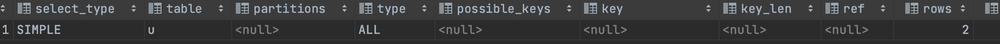
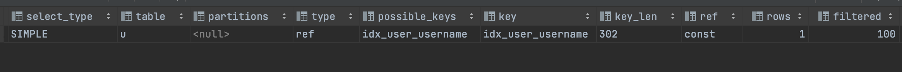
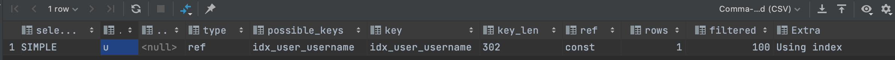
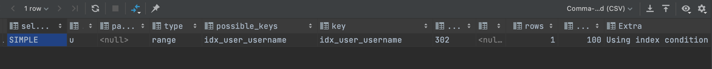
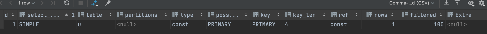

1.1 、user 无索引时
````
explain select * from user u where u.username = 'x';
````


1.2 、user 增加username 索引

````
CREATE INDEX idx_user_username ON user(username) ;
explain select * from user u where u.username = 'x';
````

````
explain select username from user u where u.username = 'x';
````
1.2.2 索引覆盖 查询结果中只有该索引
````
explain select username from user u where u.username = 'x';
````


1.2.3 索引模糊查询 左对齐
````
explain select * from user u where u.username like 'x%';

````



1.3 主键查询
````
explain select * from user u where u.id = 1;
````

