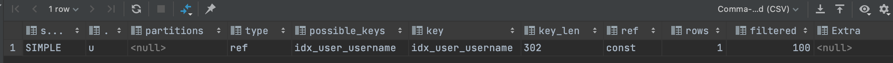

1.1 、user 无索引时
````
explain select * from user u where u.username = 'x';
````


1.2 、user 增加username 索引

````
CREATE INDEX idx_user_username ON user(username) ;
explain select * from user u where u.username = 'x';
````

````
explain select username from user u where u.username = 'x';
````

